<h1 align="center">Hamet Coulibaly</h1>

  
  
  

I'm a computer science student at The City College of New York with a strong interest in
machine learning and data science.

## Favorite projects

**[Prism](https://github.com/acm-ccny/Prism)** — a bias-detection web app for news
articles. Paste a topic or URL and Prism pulls related coverage, classifies it as
left-leaning, center or right-leaning, and lays the spectrum side by side so you can see
how differently the same story gets told. Built with ACM at CCNY; I worked on the article
search and scraping.

`Next.js` · `FastAPI` · `PyTorch` · `Hugging Face` · `Supabase`

**[Brain Tumor MRI Detection](https://github.com/SahilMulki/brain-tumor-detection)** — a
convolutional neural network that reads brain MRI scans and classifies them as glioma,
meningioma, pituitary tumor or no tumor, trained on a balanced 7,200-image dataset. A
seven-person team project; I worked on the model and the Streamlit demo app.

`PyTorch` · `CNN` · `Streamlit` · `scikit-learn`

## Tools

## Activity

  

  

